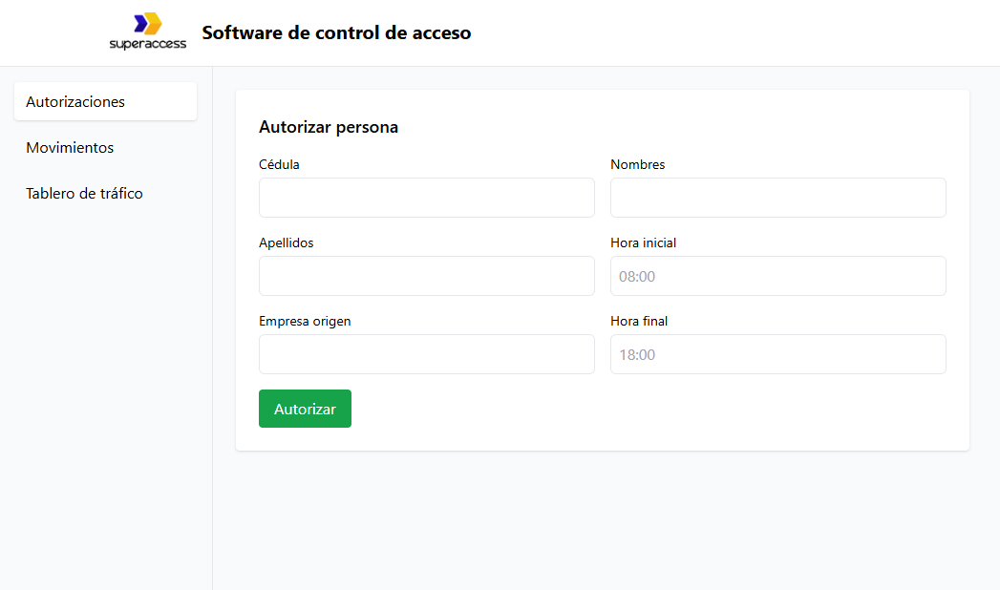

# 🟩 SuperAccess Frontend – Vue 3 + TailwindCSS

Frontend del sistema de **Control de Accesos SuperAccess**, desarrollado como parte de la prueba técnica.
Este proyecto consume un backend en **Ruby on Rails API** y permite registrar movimientos, consultar accesos del día y operar un dashboard básico.

---

## 🚀 Tecnologías utilizadas

* **Vue 3** (Composition API)
* **TailwindCSS**
* **Axios**
* **Vue Router**
* **PostCSS**
* **Vue CLI Service**

---

## 📁 Estructura del proyecto

```
superaccess-frontend/
│
├── public/
│   └── index.html
│
├── src/
│   ├── assets/
│   ├── components/
│   │   ├── Modal.vue
│   │   ├── TheHeader.vue
│   │   ├── TheSidebar.vue
│   ├── views/
│   │   ├── AuthorizationsView.vue
│   │   ├── RegisterMovementView.vue
│   │   ├── TrafficBoardView.vue
│   ├── services/
│   │   └── api.js
│   ├── router/
│   │   └── index.js
│   ├── App.vue
│   └── main.js
│
└── tailwind.config.js
```

---

## ⚙️ Instalación

### 1️⃣ Clonar repositorio

```bash
git clone https://github.com/lmmenesessupervisa/frontend-capacitacion-desarrollo
cd superaccess-frontend
```

---

### 2️⃣ Instalar dependencias

```bash
npm install
```

---

### 3️⃣ Ejecutar en modo desarrollo

```bash
npm run serve
```

---

### 4️⃣ Acceder al proyecto

* **Local:** [http://localhost:8080](http://localhost:8080)

> El archivo `vue.config.js` ya está configurado para permitir acceso externo (0.0.0.0) y WebSocket funcionando con WSL2.

---

## 🌐 Configuración del cliente Axios

El frontend se comunica con el backend Rails mediante `src/services/api.js`:

```js
import axios from "axios"

export const api = axios.create({
  baseURL: "http://localhost:3000"
})
```

---

## 📝 Funcionalidades principales

### ✔️ Registrar acceso

Formulario para registrar:

* Cédula
* Placa (opcional)
* Sentido (Entrada / Salida)

Ejemplo de solicitud enviada al backend:

```js
api.post('/movements', {
  identification_number: cedula.value,
  way: sentido.value,
  vehicle_plate: placa.value
})
```

---

### ✔️ Modal de confirmación

El componente `Modal.vue` gestiona mensajes de éxito/error:

```vue
<Modal :show="showModal" @close="showModal = false">
  <p class="text-lg font-semibold">{{ modalMessage }}</p>
</Modal>
```

---

### ✔️ Dashboard del día

Muestra todos los movimientos registrados hoy:

* Cédula
* Nombre y apellido
* Fecha y hora
* Entrada / Salida
* Placa
* Mensaje

Consumo de endpoint:

```js
api.get('/movements/today')
```

---

## 🎨 Estilos con TailwindCSS

Tailwind está habilitado mediante:

```
npx tailwindcss init -p
```

Incluido en `src/assets/tailwind.css`:

```css
@tailwind base;
@tailwind components;
@tailwind utilities;
```

---

## 📦 Build para producción

```bash
npm run build
```

Los archivos finales se generan en `dist/`.

---

## 📸 Preview

```md

```

---

## 🤝 Conexión con Backend

El proyecto utiliza dos endpoints principales:

| Acción                      | HTTP | Ruta               |
| --------------------------- | ---- | ------------------ |
| Registrar movimiento        | POST | `/movements`       |
| Obtener movimientos del día | GET  | `/movements/today` |

---


